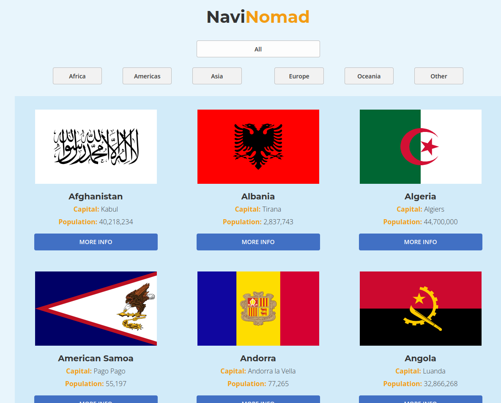

# NaviNomad Explorer 🌍

NaviNomad Explorer is a web application built with React that allows users to search and discover information about countries from around the world. With a simple and intuitive interface, users can quickly find details such as population, currency, languages, and more. Additionally, users can mark their favorite countries for easy access in the future.



**Check Out the Site:** [NaviNomad Explorer] (https://navi-nomad-react.vercel.app/)

## Features 🚀

- **Instant Search**: No more waiting. Get instant results as you type.
- **Comprehensive Data**: Dive deep into country specifics - from history snippets to geographical details.
- **Favorites at a Glance**: With a single click, bookmark your dream destinations.
- **Universal Access**: Whether you're on a desktop in New York or a mobile in Tokyo, NaviNomad has got you covered.

## Getting Started

### Prerequisites

A modern web browser (e.g., Chrome, Firefox, Safari, Edge).

### Installation

1. Clone the repository:
   
   ```bash
   git clone git@github.com:suleosmann/navi-nomad-react.git


2. Navigate to the project directory:

   cd navi-nomad-react


3. Run the app locally:
   
   npm install
   npm start

### User Guide 📘

1. **Start Your Journey**: Simply type the name of your desired country in the search bar.
2. **Deep Dive**: Click on any country to unveil a treasure trove of information.
3. **Bookmarking Memories**: Loved a country? Click on the heart icon to add it to your favorites.
4. **Revisiting Memories**: Access your favorites anytime from the main menu.

## Behind the Scenes ⚙️

 ### Built With Passion Using
1. **React**: The foundation of this modern web app.
2, **HTML5** and **CSS3**: The magic that brings life to the frontend.
3. **JavaScript (ES6+)**: The heart that makes everything tick.
4. **RestCountries API**: The brain that feeds us with knowledge.

### Setup and Launch 🚀

1. **Get the Code**: `git clone git@github.com:suleosmann/navi-nomad.git`
2. **Step Inside**: `cd navi-nomad`
3. **Witness the Magic**: Open `index.html` in your favorite browser.

### Kudos and Credits 🙌

A massive shoutout to [RestCountries](https://restcountries.com/) for their incredible API. This project stands on the shoulders of giants.

Heartfelt gratitude to all open-source contributors and the vibrant community for their endless inspiration.

## License

This project is licensed under the [MIT License](LICENSE).
